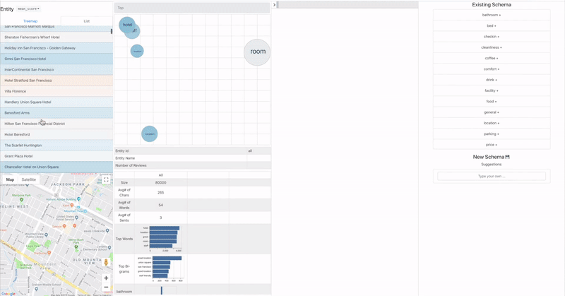
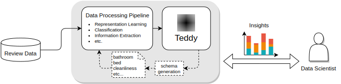

# Teddy, the Review Explorer  

This page contains the source code and supplementary material for our CHI 2020 submission: "Teddy: A System for Interactive Review Analysis" (Submission ID 2234).

1. [Introduction](#Introduction)
   - [Demo Video of Contributions](#Contributions)
   - [Online Demo](#Demo)
2. [Motivation: An Interview Study into Review Analysis Practices and Challenges](#InterviewStudy)
3. [How to use the data and source code in this repo?](#Use)
   - [Installation](#Installation)
   - [API Keys](#Keys)
   - [Running the Application](#Run)
4. [The Dataset](#Dataset)

<a name='Introduction'></a><h3> Introduction </h3> 
---------------------------------------

Teddy (Text Exploration for Diving into Data deeplY) is an interactive system that enables data scientists to quickly obtain insights from reviews and improve their extraction and modeling pipelines. Please watch <a name='Contributions' href="https://drive.google.com/open?id=1bAu0FXF6t6I2ESuEFcvcYX-M6WJWi3so">the demo video</a> for an overview of the system and our contributions. 

__<a name='Demo'></a>[You can also try Teddy online here!](http://ec2-54-67-71-12.us-west-1.compute.amazonaws.com:3000/)__



Above: The Teddy user interface. From left to right we have the Entity View displaying the entities mentioned in reviews, the Cluster View for exploring aggregate statistics over hierarchical clusters of reviews, the Detail View for viewing and filtering/sorting individual reviews, and the Schema Generation View for recording aspects of interest from the reviews. 

<br/>
<br/>



Above: The Teddy review exploration pipeline. Users can customize the data processing pipeline based on their task, whether it
is classification, opinion extraction, or representation learning, and use Teddy to gain insights about their data and model. They can also use the application to iterate on the data processing pipeline, for example by creating a new schema that describes attributes of their review corpus. 

<a name='InterviewStudy'></a><h3> Motivation: An Interview Study into Review Analysis Practices and Challenges </h3> 
---------------------------------------

We conducted an interview study with fourteen participants to better understand the workflows and rate-limiting tasks of data scientists working on reviews, which motivated the development of features in Teddy. We used an iterative coding method to aggregate the collected data.

__[Download the results of our iterative coding here](https://github.com/teddyauthors/teddy/raw/readme/results/interview_study_iterative_coding.xlsx).__

Anonymized notes from individual interviews and our interview question template are also available in the `results/` folder.

<a name='Use'></a><h3> How to use the data and source code in this repo? </h3>
---------------------------------------

Important Folders
* `app/` server and front-end code
* `data/` subdirectories containing Trip Advisor data or your own datasets
* `libs/` python libraries for data processing
* `tests/` testing code for the code in `libs/`

<a name='Installation'></a><h4> Local Installation </h4> 
Teddy requires Python 3.5 or above.  Make sure you have `venv` installed. If you don't, run `python3 -m pip install virtualenv`

```bash
# Install dependencies
make install ENV=local
# Build dependencies
make build
# These will automatically run in a virtual environment called 'venv'
```

<a name='Keys'></a><h4> API Keys (Optional) </h4> 
Teddy requires Google API Keys in order to render the map and the hotel images. Please refer to [Google Maps Platform](https://developers.google.com/maps/documentation/embed/get-api-key) on how to get an API Key, and enable the Maps JavaScript API and the Places API.

<a name='Run'></a><h4> Running the Application </h4> 
```bash
# start the backend server
make server
# start the user interface
make ui
```
Then navigate to [http://localhost:3000](http://localhost:3000) in your browser.

<a name='Dataset'></a><h3> The Dataset </h3>
---------------------------------------

The [reviews we provide](https://github.com/teddyauthors/teddy/blob/readme/data/tripadvisor_hotels.zip) in order to demonstrate the application are provided by Trip Advisor under the [Creative Commons Attribution Non-Commercial 4.0 International License](https://creativecommons.org/licenses/by-nc/4.0/legalcode).

(Barkha Bansal. (2018). TripAdvisor Hotel Review Dataset. Zenodo. [http://doi.org/10.5281/zenodo.1219899](http://doi.org/10.5281/zenodo.1219899)). 

A subset of the reviews for San Francisco hotels have been selected and modified by (1) computing extractions of aspect, opinion pairs and (2) clustering and computing statistics over those clusters.

Some of the icons used in our application are made by [Freepik](https://www.flaticon.com/authors/freepik) and can be found at [www.flaticon.com](https://www.flaticon.com).
