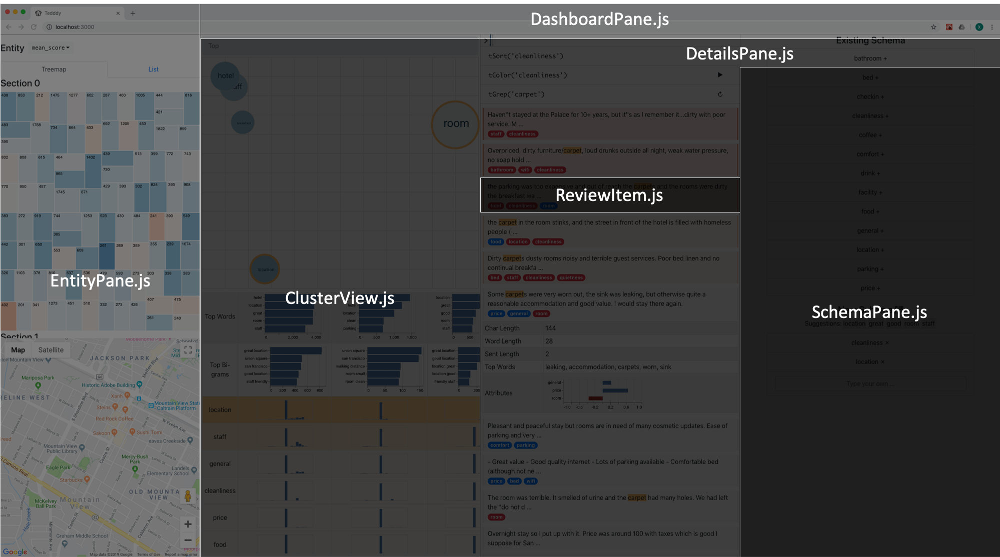

* To install packages: `npm install`
* To build: `npm run build`
* To run with live-updates: `npm run start`
> Also refer to [create-react-app](https://github.com/facebook/create-react-app) documents for other useful scripts.

All the source code files for components are located flat in the `src` folder. As of 8/22/2019, Here is how to locate each component:

